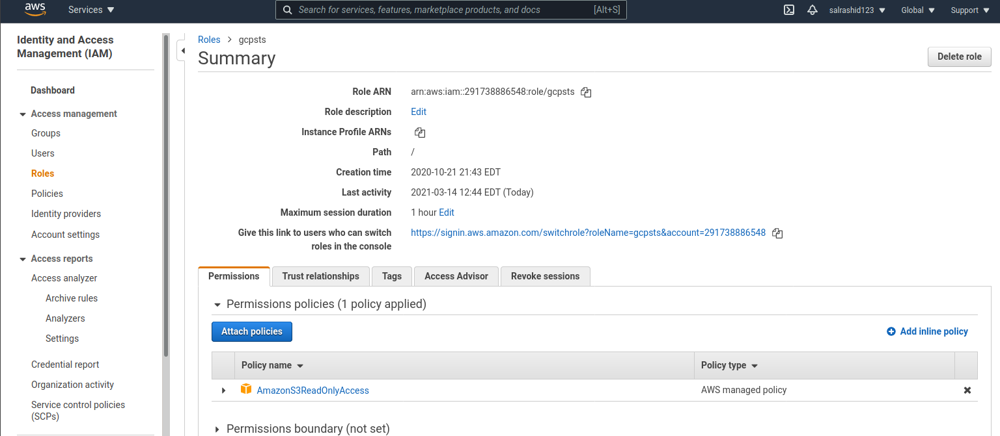
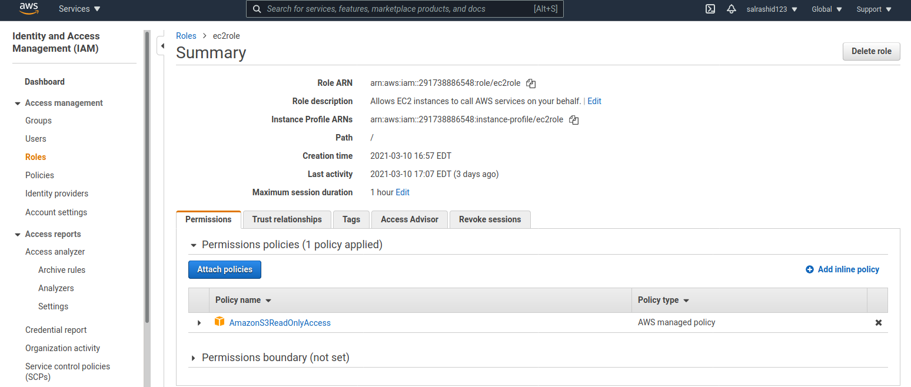
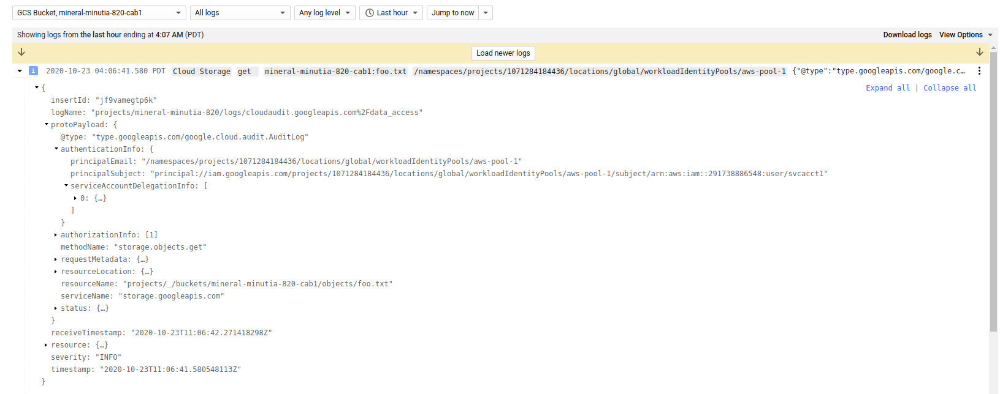

## GCP Workload Identity Federation using AWS Credentials

This is a sample procedure that will exchange a long term or short term AWS credential for a GCP credential.

You can use the GCP credential  to access any service the mapped principal has GCP IAM permissions on.

This article and repo is the first part that explores how to use the [workload identity federation](https://cloud.google.com/iam/docs/access-resources-aws) capability of GCP which allows for external principals (AWS,Azure or arbitrary OIDC provider) to map to a GCP credential.

The two variations described in this repo will acquire a Google Credential as described here:
 - [https://cloud.google.com/iam/docs/access-resources-aws#generate](https://cloud.google.com/iam/docs/access-resources-aws#generate)

The "Automatic" way is recommended and is supported by Google

The "Manual" way is also covered in this repo but I decided to wrap the steps for that into my own library here [github.com/salrashid123/oauth2/google](https://github.com/salrashid123/oauth2#usage-aws) which surfaces the credential as an [oauth2.TokenSource](https://godoc.org/golang.org/x/oauth2#TokenSource) for use in any GCP cloud library.  

>> NOTE: the library i'm using for the "manual" way is just there as an unsupported demo of a wrapped oauth2 TokenSource! 

You can certainly use either procedure but the Automatic way is included with the *supported, standard* GCP Client library.

>> This repository is not supported by Google
>> `salrashid123/oauth2/google` is also not supported by Google

also see
- [GCP Workload Identity Federation using OIDC Credentials](https://github.com/salrashid123/gcpcompat-oidc)
- [GCP Workload Identity Federation using SAML Credentials](https://github.com/salrashid123/gcpcompat-saml)
- [GCP Workload Identity Federation using AWS Credentials](https://github.com/salrashid123/gcpcompat-aws)
 
---

### Workload Federation - AWS

GCP now surfaces a `STS Service` that will exchange one set of tokens for another using the GCP Secure Token Service (STS) [here](https://cloud.google.com/iam/docs/reference/sts/rest/v1beta/TopLevel/token).  These initial tokens can be either 3rd party or google `access_tokens` that are [downscoped](https://github.com/salrashid123/downscoped_token) (i.,e attenuated in permission set).

To use this tutorial, you need both a GCP and AWS project and the ability to create user/service accounts and then apply permissions on those to facilitate the mapping.

Again, the two types of flows this repo demonstrates:  

- Manual Exchange:
  In this you manually do all the steps of exchanging `AWS_ACCESS_KEY_ID/AWS_SECRET_ACCESS_KEY` for a federated token and then finally use that token

- Automatic Exchange
  In this you use the google cloud client libraries to do all the heavy lifting.  << This is the recommended approach


>> It is recommended to do the manual first just to understand this capability and then move onto the automatic


#### AWS User/Session/Roles --> GCP Identity --> GCP Resource

This tutorial will cover various source AWS identity for federation and how they map to a GCP  [principal:// and principalSet://](https://cloud.google.com/iam/docs/workload-identity-federation#impersonation)

a) `AWS User --> GCP principal:// --> Impersonate Service Account --> GCP Resource`

  AWS User  `"Arn": "arn:aws:iam::291738886548:user/svcacct1"` mapped to 
  `principal://iam.googleapis.com/projects/$PROJECT_NUMBER/locations/global/workloadIdentityPools/aws-pool-1/subject/arn:aws:iam::291738886548:user/svcacct1`

b) `AWS User --> AWS Assumed Role --> AWS Named Session --> GCP principal:// --> Impersonate Service Account --> GCP Resource`

  AWS User will Assume a Role and then acquire a *NAMED* AWS Session
  `"Arn": "arn:aws:sts::291738886548:assumed-role/gcpsts/mysession"` mapped to 
  `principal://iam.googleapis.com/projects/$PROJECT_NUMBER/locations/global/workloadIdentityPools/aws-pool-1/subject/arn:aws:sts::291738886548:assumed-role/gcpsts/mysession`

c) `AWS User --> AWS Assumed Role --> GCP principalSet:// --> Impersonate Service Account --> GCP Resource`

  AWS User assumes Role
`arn:aws:sts::291738886548:assumed-role/gcpsts` mapped to
`principalSet://iam.googleapis.com/projects/$PROJECT_NUMBER/locations/global/workloadIdentityPools/aws-pool-2/attribute.aws_role/arn:aws:sts::291738886548:assumed-role/gcpsts`

d) `AWS EC2 --> AWS Assumed EC2 Role -->  GCP principalSet:// --> Impersonate Service Account --> GCP Resource`

  AWS EC2 Role
  `arn:aws:sts::291738886548:assumed-role/ec2role` mapped to
  `"principalSet://iam.googleapis.com/projects/$PROJECT_NUMBER/locations/global/workloadIdentityPools/aws-pool-2/attribute.aws_role/arn:aws:sts::291738886548:assumed-role/ec2role"`


Option (d) is likely the most common usecase since it allows a group of EC2 instances to collectively map to a GCP identity.

a) is used to map a given user (`aws-pool-1/subject/`)
b) is used to map a user to a _named session_ as a subject.
c) is used to map a user that assumes a role (`aws-pool-2/attribute.aws_role`)

#### Manual Exchange

On the AWS side, you need to configure a user, then allow it to `AssumeRole` to derive a short-term token.  You do not need to go the extra step to assumeRole but this example shows best-practices for short-lived tokens.

1. Create AWS user
  In this case, the user is `"arn:aws:iam::291738886548:user/svcacct1"` with uid=`AIDAUH3H6EGKDO36JYJH3`

Using local env-var based bootstrap on your laptop:

```bash
$ export AWS_ACCESS_KEY_ID=redacted 
$ export AWS_SECRET_ACCESS_KEY=redacted

$ aws sts get-caller-identity
{
    "UserId": "AIDAUH3H6EGKDO36JYJH3",
    "Account": "291738886548",
    "Arn": "arn:aws:iam::291738886548:user/svcacct1"
}
```


2. Define Role

Allow the user to assume an AWS role (`gcpsts`)

In this case, we are assuming a role and a named session `arn:aws:sts::291738886548:assumed-role/gcpsts/mysession`


```bash
$ aws sts assume-role --role-arn arn:aws:iam::291738886548:role/gcpsts --role-session-name mysession
{
    "Credentials": {
        "AccessKeyId": "ASIAUH3H6EGKHQ-redacted",
        "SecretAccessKey": "WgsIFtkz4mzb9ArKlds7ZFZDQEe-redacted",
        "SessionToken": "FwoGZXIvYXdzEF-redacted",
        "Expiration": "2020-10-22T12:26:05+00:00"
    },
    "AssumedRoleUser": {
        "AssumedRoleId": "AROAUH3H6EGKHZUSB4BC5:mysession",
        "Arn": "arn:aws:sts::291738886548:assumed-role/gcpsts/mysession"
    }
}
```


3.  Verify Role change

Use the assumed roles token to confirm the change
```bash
export AWS_ACCESS_KEY_ID=ASIAUH3H6EG-redacted
export AWS_SECRET_ACCESS_KEY=pyDAMjC+aoDT7wWE5MbVCw9j-redacted
export AWS_SESSION_TOKEN=FwoGZXIvYXdzEF-redacted

$ aws sts get-caller-identity
{
    "UserId": "AROAUH3H6EGKHZUSB4BC5:mysession",
    "Account": "291738886548",
    "Arn": "arn:aws:sts::291738886548:assumed-role/gcpsts/mysession"
}
```

### GCP

Switch to the GCP account


1. Create Service Account

Create a service account the AWS one will map to and grant this service account permissions on something (eg, gcs bucket)

```bash
export PROJECT_ID=`gcloud config get-value core/project`
export PROJECT_NUMBER=`gcloud projects describe $PROJECT_ID --format='value(projectNumber)'`

gcloud iam service-accounts create aws-federated


# upload a sample file to GCS which we will later recall using the federated flow

gsutil mb gs://$PROJECT-mybucket
echo fooooo > foo.txt
gsutil cp foo.txt gs://$PROJECT-mybucket
gsutil iam ch serviceAccount:aws-federated@$PROJECT.iam.gserviceaccount.com:objectViewer gs://$PROJECT-mybucket
```

From here, you can test using `principal://` or `principalSet://` as described above

#### Using  (principal://)

The following commands below we are specifically mapping an arn to a subject.  That is, it will match for *exactly*

* `"arn:aws:iam::291738886548:user/svcacct1"` (user)
* `"arn:aws:sts::291738886548:assumed-role/gcpsts/mysession"` (session)

- First create a workflow identity pool 

```bash
gcloud beta iam workload-identity-pools create aws-pool-1 \
    --location="global" \
    --description="AWS " \
    --display-name="AWS Pool"
```

- Define aws-provider

Define the aws-provider associated with that pool using your AWS AccountID (in this case its `291738886548`). 

The `attribute-mapping=` sections are the default mapping that does the actual translation from the AWS `getCallerIdentity()` claim back to a GCP principal.  
You can define other mappings but we're using the default

```bash
gcloud beta iam workload-identity-pools providers create-aws aws-provider-1  \
   --workload-identity-pool="aws-pool-1"     --account-id="291738886548"   \
   --location="global"
```

(note, we are using the [default mapping](https://cloud.google.com/iam/docs/access-resources-aws#add-aws)  `attribute-mapping="google.subject=assertion.arn,attribute.aws_role=..."`)

- Grant WorkloadIdentity Pool to use SA

Now grant the mapped identity permissions to assume the actual GCP service account.

In the example below, we're allowing a user (`arn:aws:iam::291738886548:user/svcacct1`) and specific sessonName (`arn:aws:sts::291738886548:assumed-role/gcpsts/mysession`) will be allowed to impersonate `aws-federated@$PROJECT.iam.gserviceaccount.com`

```bash
gcloud iam service-accounts add-iam-policy-binding aws-federated@$PROJECT_ID.iam.gserviceaccount.com   \
    --role roles/iam.workloadIdentityUser \
    --member "principal://iam.googleapis.com/projects/$PROJECT_NUMBER/locations/global/workloadIdentityPools/aws-pool-1/subject/arn:aws:iam::291738886548:user/svcacct1"

gcloud iam service-accounts add-iam-policy-binding aws-federated@$PROJECT_ID.iam.gserviceaccount.com   \
    --role roles/iam.workloadIdentityUser \
    --member "principal://iam.googleapis.com/projects/$PROJECT_NUMBER/locations/global/workloadIdentityPools/aws-pool-1/subject/arn:aws:sts::291738886548:assumed-role/gcpsts/mysession"
```

#### Using  (principalSet://)

Use (`principalSet://`) to map any AWS system that assumes a role.  For example, if you have a set of AWS EC2 instances that all can assume a specific Role name, use `principalSet://`

Note the command below we are specifically mapping federation on _TWO_ Roles that we will demo shortly.  The first one is for a user to assume that role; the second one is for ec2 itself.

* `"arn:aws:sts::291738886548:assumed-role/gcpsts"`
* `"arn:aws:sts::291738886548:assumed-role/ec2role"`





- Define identity-pool

We will create a new identity pool here just to test this separately from (a)

```bash
gcloud beta iam workload-identity-pools create aws-pool-2 \
    --location="global" \
    --description="AWS " \
    --display-name="AWS Pool 2"
```
- Define aws-provider

```bash
gcloud beta iam workload-identity-pools providers create-aws aws-provider-2  \
   --workload-identity-pool="aws-pool-2"     --account-id="291738886548"   \
   --location="global" 
```

(note, we are again using the default mapping `attribute-mapping` of `"google.subject=assertion.arn"` and `attribute.aws_role=<AWS Role>`)

- Grant WorkloadIdentity Pool to use the service account

```bash
gcloud iam service-accounts add-iam-policy-binding aws-federated@$PROJECT_ID.iam.gserviceaccount.com   \
    --role roles/iam.workloadIdentityUser \
    --member "principalSet://iam.googleapis.com/projects/$PROJECT_NUMBER/locations/global/workloadIdentityPools/aws-pool-2/attribute.aws_role/arn:aws:sts::291738886548:assumed-role/gcpsts" 

gcloud iam service-accounts add-iam-policy-binding aws-federated@$PROJECT_ID.iam.gserviceaccount.com   \
    --role roles/iam.workloadIdentityUser \
    --member "principalSet://iam.googleapis.com/projects/$PROJECT_NUMBER/locations/global/workloadIdentityPools/aws-pool-2/attribute.aws_role/arn:aws:sts::291738886548:assumed-role/ec2role" 
```

---

You should end up with IAM bindings on the service account that is used for impersonation. The bindings below shows both `principal://` and `principalSet://`

```bash
$ gcloud iam service-accounts get-iam-policy aws-federated@$PROJECT_ID.iam.gserviceaccount.com  
bindings:
- members:
  - principal://iam.googleapis.com/projects/1071284184436/locations/global/workloadIdentityPools/aws-pool-1/subject/arn:aws:iam::291738886548:user/svcacct1
  - principal://iam.googleapis.com/projects/1071284184436/locations/global/workloadIdentityPools/aws-pool-1/subject/arn:aws:sts::291738886548:assumed-role/gcpsts/mysession
  - principalSet://iam.googleapis.com/projects/1071284184436/locations/global/workloadIdentityPools/aws-pool-2/attribute.aws_role/arn:aws:sts::291738886548:assumed-role/gcpsts
  - principalSet://iam.googleapis.com/projects/1071284184436/locations/global/workloadIdentityPools/aws-pool-2/attribute.aws_role/arn:aws:sts::291738886548:assumed-role/ec2role
  role: roles/iam.workloadIdentityUser
version: 1
```


### Automatic Exchange

With the automatic exchange, the GCP cloud auth libraries do all these steps for you.

In this tutorial, setup an EC2 VM, install golang and configure it such that you can assume the role `ec2role` automatically on the VM


For this to work, you must have previously setup the `aws-federated@$PROJECT_ID.iam.gserviceaccount.com` service account and gave it permissions to the GCS object.  You should have also configured the `aws-provider-2` configurations and use `principalSet://`

First step is to generate the client library helper file which will act as the `APPLICATION_DEFAULT_CREDENTIAL`

```bash
gcloud beta iam workload-identity-pools create-cred-config \
    projects/$PROJECT_NUMBER/locations/global/workloadIdentityPools/aws-pool-2/providers/aws-provider-2 \
    --service-account=aws-federated@$PROJECT_ID.iam.gserviceaccount.com \
    --output-file=sts-creds.json \
    --aws
```

It should look something like this in `sts-creds.json`:

```json
{
  "type": "external_account",
  "audience": "//iam.googleapis.com/projects/1071284184436/locations/global/workloadIdentityPools/aws-pool-2/providers/aws-provider-2",
  "subject_token_type": "urn:ietf:params:aws:token-type:aws4_request",
  "token_url": "https://sts.googleapis.com/v1/token",
  "credential_source": {
    "environment_id": "aws1",
    "region_url": "http://169.254.169.254/latest/meta-data/placement/availability-zone",
    "url": "http://169.254.169.254/latest/meta-data/iam/security-credentials",
    "regional_cred_verification_url": "https://sts.{region}.amazonaws.com?Action=GetCallerIdentity&Version=2011-06-15"
  },
  "service_account_impersonation_url": "https://iamcredentials.googleapis.com/v1/projects/-/serviceAccounts/aws-federated@mineral-minutia-820.iam.gserviceaccount.com:generateAccessToken"
}
```

What that basically states is for GCP to look for AWS federation credentials from the EC2 metadata server or from the AWS env variables in the current shell.  Once the AWS credentials are acquired, the client library will perform the STS exchange and enable the GCP client library access.

Copy the `sts-creds.json` file to the EC2 instance

On the EC2 instance, make sure it has a role binding:

```bash
[root@ip-172-31-28-179 test]# aws sts get-caller-identity
{
    "Account": "291738886548", 
    "UserId": "AROAUH3H6EGKM3W5BCPKR:i-01eb8a107a2026dcd", 
    "Arn": "arn:aws:sts::291738886548:assumed-role/ec2role/i-01eb8a107a2026dcd"
}
```

Now Make sure you've previously mapped the Assumed Role defined for `aws-pool-2` as a `principalSet://`

```bash
gcloud iam service-accounts add-iam-policy-binding aws-federated@$PROJECT_ID.iam.gserviceaccount.com   \
    --role roles/iam.workloadIdentityUser \
    --member "principalSet://iam.googleapis.com/projects/$PROJECT_NUMBER/locations/global/workloadIdentityPools/aws-pool-2/attribute.aws_role/arn:aws:sts::291738886548:assumed-role/ec2role" 
```

---
### Test Automatic

Finally, on the EC2 instance, invoke the client provided in this repo:

```bash
export GOOGLE_APPLICATION_CREDENTIALS=`pwd`/sts-creds.json

$ go run main.go    --gcpBucket mineral-minutia-820-cab1    --gcpObjectName foo.txt    --useADC
  2021/03/10 22:05:36 >>>>>>>>>>>>>>>>> Using ADC
  FOOOOO
```

the `FOOOO` is the contents of our file on GCS

If you are on your laptop and have the AWS Environment variables, you can also use the automatic flow

```bash
export AWS_ACCESS_KEY_ID=redacted 
export AWS_SECRET_ACCESS_KEY=redacted
export AWS_DEFAULT_REGION=us-east-1

export GOOGLE_APPLICATION_CREDENTIALS=`pwd`/sts-creds.json
$ go run main.go    --gcpBucket mineral-minutia-820-cab1    --gcpObjectName foo.txt    --useADC
```

>> TODO: update google storage client library to pickup [PR482](https://github.com/golang/oauth2/pull/482)

---

### Test Manual

For manual testing, we are using `main.go` which simply wraps the flow on your laptop (note the automatic was done on an EC2 instance)

- Flags:
```golang
  gcpBucket               = flag.String("gcpBucket", "mineral-minutia-820-cab1", "GCS Bucket to access")
  gcpObjectName           = flag.String("gcpObjectName", "foo.txt", "GCS object to access")
  gcpResource             = flag.String("gcpResource", "//iam.googleapis.com/projects/1071284184436/locations/global/workloadIdentityPools/aws-pool-1/providers/aws-provider-1", "the GCP resource to map")
  gcpTargetServiceAccount = flag.String("gcpTargetServiceAccount", "aws-federated@mineral-minutia-820.iam.gserviceaccount.com", "the ServiceAccount to impersonate")

  awsRegion          = flag.String("awsRegion", "us-east-1", "AWS Region")
  awsRoleArn         = flag.String("awsRoleArn", "arn:aws:iam::291738886548:role/gcpsts", "ARN of the role to use")
  awsSessionName     = flag.String("awsSessionName", "mysession", "Name of the session to use")
  useADC             = flag.Bool("useADC", false, "Use Application Default Credentials")
  awsAccessKeyID     = flag.String("awsAccessKeyID", "AKIAUH3H6EGKE-redacted", "AWS access Key ID")
  awsSecretAccessKey = flag.String("awsSecretAccessKey", "YRJ86SK5qTOZQzZTI1u/cA5z5KmLT-redacted", "AWS SecretKey")
  useIAMToken        = flag.Bool("useIAMToken", false, "Use IAMCredentials Token exchange")
```

a) as user:

```bash
$ export AWS_ACCESS_KEY_ID=...
$ export AWS_SECRET_ACCESS_KEY=...
$ export AWS_REGION=us-east-1


$ aws sts get-caller-identity
{
    "UserId": "AIDAUH3H6EGKDO36JYJH3",
    "Account": "291738886548",
    "Arn": "arn:aws:iam::291738886548:user/svcacct1"
}

$ go run main.go \
   --gcpBucket mineral-minutia-820-cab1 \
   --gcpObjectName foo.txt \
   --gcpResource //iam.googleapis.com/projects/$PROJECT_NUMBER/locations/global/workloadIdentityPools/aws-pool-1/providers/aws-provider-1 \
   --gcpTargetServiceAccount aws-federated@$PROJECT_ID.iam.gserviceaccount.com \
   --useIAMToken \
   --awsRegion $AWS_REGION \
   --awsRoleArn arn:aws:iam::291738886548:role/gcpsts \
   --awsSessionName mysession \
   --awsAccessKeyID $AWS_ACCESS_KEY_ID \
   --awsSecretAccessKey $AWS_SECRET_ACCESS_KEY 
 
2020/10/22 15:32:50 Original Caller Identity :{
  Account: "291738886548",
  Arn: "arn:aws:iam::291738886548:user/svcacct1",
  UserId: "AIDAUH3H6EGKDO36JYJH3"
}

2020/10/22 15:32:50 Assumed user Arn: arn:aws:sts::291738886548:assumed-role/gcpsts/mysession
2020/10/22 15:32:50 Assumed AssumedRoleId: AROAUH3H6EGKHZUSB4BC5:mysession
2020/10/22 15:32:50 New Caller Identity :{
  Account: "291738886548",
  Arn: "arn:aws:sts::291738886548:assumed-role/gcpsts/mysession",
  UserId: "AROAUH3H6EGKHZUSB4BC5:mysession"
}
2020/10/22 15:32:51 AWS Derived GCP access_token: ya29.c.KpUD4ge5T4NtKAvjbMvOm2DsB6L28hTdrwtAV3Ts-redacted

fooooo
```
### Using Federated or IAM Tokens

GCP STS Tokens can be used directly against a **few** GCP services such as (IAMCredentials and GCS (more to come later)).

What that means is that you do not need to enable iam impersonation on these tokens to access these services; the STS token can be used directly.

Basically, that means you can skip step `(5)` of [Exchange Token](https://cloud.google.com/iam/docs/access-resources-aws#exchange-token)

This not only saves the step of running the exchange but omits the need for a secondary GCP service account to impersonate.

To use GCS, allow either the Assumed Role or AWS User access to the resource.  In this case `storage.objectAdmin` access  (yes, i'm granting the permissions below on the project, you should grant on the bucket only):

To use Federated tokens, use remove the `--useIAMToken` flag and allow the federated identity _direct)access

```bash
# principal://
# names session
gcloud projects add-iam-policy-binding $PROJECT_ID  \
 --member "principal://iam.googleapis.com/projects/$PROJECT_NUMBER/locations/global/workloadIdentityPools/aws-pool-1/subject/arn:aws:sts::291738886548:assumed-role/gcpsts/mysession" \
   --role roles/storage.objectAdmin
# user
gcloud projects add-iam-policy-binding $PROJECT_ID  \
    --member "principal://iam.googleapis.com/projects/$PROJECT_NUMBER/locations/global/workloadIdentityPools/aws-pool-1/subject/arn:aws:iam::291738886548:user/svcacct1"\
      --role roles/storage.objectAdmin

# principalSet://
# named role
gcloud projects add-iam-policy-binding $PROJECT_ID  \
 --member "principalSet://iam.googleapis.com/projects/$PROJECT_NUMBER/locations/global/workloadIdentityPools/aws-pool-2/attribute.aws_role/arn:aws:sts::291738886548:assumed-role/gcpsts" \
   --role roles/storage.objectAdmin

# ec2 role
gcloud projects add-iam-policy-binding $PROJECT_ID  \
 --member "principalSet://iam.googleapis.com/projects/$PROJECT_NUMBER/locations/global/workloadIdentityPools/aws-pool-2/attribute.aws_role/arn:aws:sts::291738886548:assumed-role/ec2role" \
   --role roles/storage.objectAdmin
```

Set `UseIAMToken:  false` in the go code


>> NOTE: the GCP "Automatic" libraries  use impersonation by default...However, if you DELETE the `service_account_impersonation_url` entry  in the sts-config.json file, the ADC library will end up using federated tokens!

### Logging

Depending on the mode you used `UseIAMToken` flag in code, you may either see the IAM service account impersonated then access the GCS resource, or the AWS principal directly.

- `UseIAMToken:  true`:
   In this mode, the AWS credential is exchanged for a GCP STS and then the GCP STS is again exchanged for a GCP ServiceAccount Token. 
      `AWS Creds` -> `GCP STS (workload pool)` -> `GCP IAM (service_account)` -> `GCS`

   The net result is you see the iam exchange but the original AWS caller is hidden in the GCSlogs
   The following shows the logs emitted if using AssumeRole


- `UseIAMToken:  false`:
   In this mode, the AWS credential is exchanged for a GCP STS creds and then directly against a GCP Resource
     `AWS Creds` -> `GCP STS (workload pool)` -> `GCS` 

   The following logs shows the dataaccess logs when accessed directly as `arn:aws:iam::291738886548:user/svcacct1`:



>> UseIAMToken=false only works on certain GCP resources.

### Direct AWS Credentials

If you want to directly pipe in the AWS credential object (`"github.com/aws/aws-sdk-go/aws/credentials"`) into GCP, you will need to use the 'unsupported' library and bootstrap AWS creds first and then pipe it into GCP creds:

In the following, we are using AWS credentials as the source with the ARN of `--awsRoleArn arn:aws:iam::291738886548:user/svcacct1 `

```golang
  // NOTE credential object below is "github.com/aws/aws-sdk-go/aws/credentials"
  creds = credentials.NewStaticCredentials(*awsAccessKeyID, *awsSecretAccessKey, "")
	conf = &aws.Config{
		Region:      aws.String(awsRegion),
		Credentials: creds,
	}
	stsService = sts.New(session, conf)
	input = &sts.GetCallerIdentityInput{}
	result, err = stsService.GetCallerIdentity(input)
	if err != nil {
		log.Fatal(err)
	}
	log.Printf("New Caller Identity :" + result.GoString())

	awsTokenSource, err := sal.AWSTokenSource(
		&sal.AwsTokenConfig{
			AwsCredential:        *creds,
			Scope:                "https://www.googleapis.com/auth/cloud-platform",
			TargetResource:       "//iam.googleapis.com/projects/1071284184436/locations/global/workloadIdentityPools/aws-pool-1/providers/aws-provider-1",
			Region:               "us-east-1",
				TargetServiceAccount: "aws-federated@mineral-minutia-820.iam.gserviceaccount.com",
				UseIAMToken:          true,
		},
	)        
```

If you want to see this work, uncomment the appropriate sections in `main.go`,  

```bash
$ go run main.go    --gcpBucket mineral-minutia-820-cab1    --gcpObjectName foo.txt  \
   --gcpResource //iam.googleapis.com/projects/$PROJECT_NUMBER/locations/global/workloadIdentityPools/aws-pool-1/providers/aws-provider-1   \
   --gcpTargetServiceAccount aws-federated@$PROJECT_ID.iam.gserviceaccount.com \
   --useIAMToken  \
   --awsRegion us-east-1 \
   --awsRoleArn arn:aws:iam::291738886548:user/svcacct1  \
   --awsAccessKeyID $AWS_ACCESS_KEY_ID \
   --awsSecretAccessKey $AWS_SECRET_ACCESS_KEY 

2021/03/14 15:38:19 Original Caller Identity :{
  Account: "291738886548",
  Arn: "arn:aws:iam::291738886548:user/svcacct1",
  UserId: "AIDAUH3H6EGKDO36JYJH3"
}

FOOOOO
```

### GCP Organization Policy 

Finally, you can restrict which AWS projects are allowed federation to GCP by [specifying a restrict](https://cloud.google.com/iam/docs/manage-workload-identity-pools-providers#restrict)
