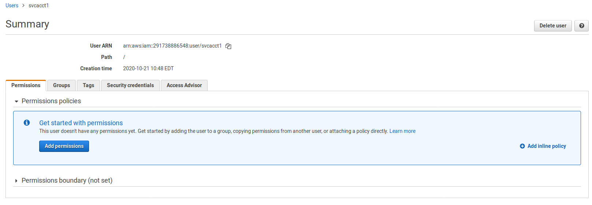
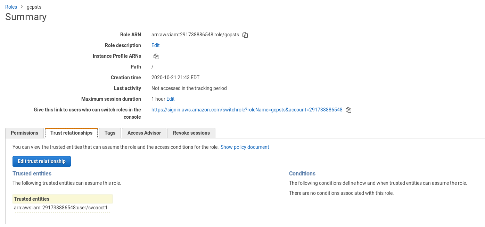
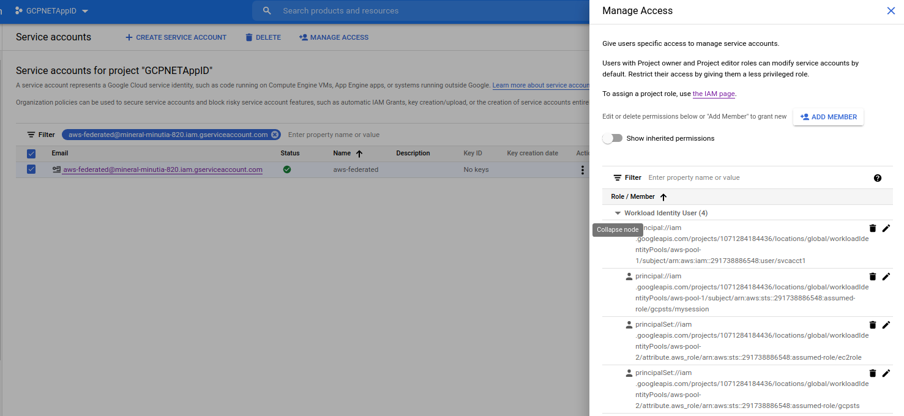
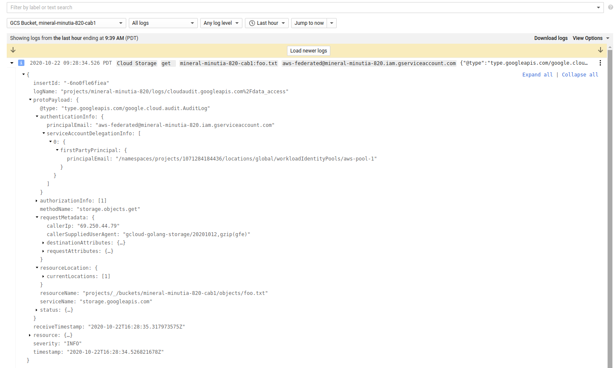

## Exchange AWS Credentials for GCP Credentials using GCP STS Service

Sample procedure and referenced library that will exchange a long term or short term AWS credential for a GCP credential.

You can use the GCP credential then to access any service the mapped principal has GCP IAM permissions on.

The referenced library [github.com/salrashid123/oauth2/google](https://github.com/salrashid123/oauth2#usage-aws) surfaces an the mapped credential as an [oauth2.TokenSource](https://godoc.org/golang.org/x/oauth2#TokenSource) for use in any GCP cloud library. 

If the underlying credentials expire, the TokenSource will automatically renew itself, hands free.

This repo is the first part that explores how to use the [workload identity federation](https://cloud.google.com/iam/docs/access-resources-aws) capability of GCP which allows for eternal principals (AWS,Azure or arbitrary OIDC provider) to map to a GCP credential.

The followup samples will demonstrate federation w/ Azure and an arbitrary OIDC provider (okta or Google Cloud Identity Platform)


>> This is not an officially supported Google product

>> `salrashid123/oauth2/google` is also not supported by Google

---

### Workload Federation - AWS

GCP now surfaces a `STS Service` that will exchange one set of tokens for another.  These initial tokens can be either 3rd party or google `access_tokens` that are [downscoped](https://github.com/salrashid123/downscoped_token) (i.,e attenuated in permission set).

The endpoint rest specifications for the STS service is [here](https://cloud.google.com/iam/docs/reference/sts/rest/v1beta/TopLevel/token)


To use this, you need both a GCP and AWS project and the ability to create user/service accounts and then apply permissions on those to facilitate the mapping.


#### AWS

On the AWS side, you need to configure a user, then allow it to `AssumeRole` to derive a short-term token.  You do not need to go the extra step to assumeRole but this example shows best-practices for short-lived tokens.

1. Create AWS user
  In this case, the user is `"arn:aws:iam::291738886548:user/svcacct1"` with uid=`AIDAUH3H6EGKDO36JYJH3`

```bash
export AWS_ACCESS_KEY_ID=redacted 
export AWS_SECRET_ACCESS_KEY=redacted
aws sts get-caller-identity
{
    "UserId": "AIDAUH3H6EGKDO36JYJH3",
    "Account": "291738886548",
    "Arn": "arn:aws:iam::291738886548:user/svcacct1"
}
```




2. Define Role

Allow the user to assume an AWS role.

In this case, the new role is `arn:aws:sts::291738886548:assumed-role/gcpsts/mysession`


```bash
$ aws sts assume-role --role-arn arn:aws:iam::291738886548:role/gcpsts --role-session-name mysession
{
    "Credentials": {
        "AccessKeyId": "ASIAUH3H6EGKHQ-redacted",
        "SecretAccessKey": "WgsIFtkz4mzb9ArKlds7ZFZDQEe-redacted",
        "SessionToken": "FwoGZXIvYXdzEFUaDCAJrrWlFMoH//c/fyKtAaI9f7Sfj7gVlYknoy78ScUB721MUs+GJRQIarlyse7p9WZmY3uF1UqoFcHx6N2jfNGdfylJaIayOSDRDTIMA+7a2r44WBi4K1CbFOGBIcPMspSsOcNTOmvrlfEV3O7OCDXQLEf8R9f6NCMXYfruoFG4SBBp90o/oEFam7A4BqiesGuzq0OVa8EyzmYiF7cKdUzjh+MMsQBFJ1q/6l5DeGC2a3Syx9AAYLKCKV3bKM3YxfwFMi2WtSO50zj9B4ZeI2xZN8/Xc6rxXp43GcBPOenY-redacted",
        "Expiration": "2020-10-22T12:26:05+00:00"
    },
    "AssumedRoleUser": {
        "AssumedRoleId": "AROAUH3H6EGKHZUSB4BC5:mysession",
        "Arn": "arn:aws:sts::291738886548:assumed-role/gcpsts/mysession"
    }
}
```




3.  Verify Role change

Use the assumed roles token to confirm the change
```bash
export AWS_ACCESS_KEY_ID=ASIAUH3H6EG-redacted
export AWS_SECRET_ACCESS_KEY=pyDAMjC+aoDT7wWE5MbVCw9j-redacted
export AWS_SESSION_TOKEN=FwoGZXIvYXdzEFkaDLrbiqp6wyx3FLWdnSKtARKDfX3oZmHa/1NwhHGABJEKGE25wpY8TvyrYr/XHCDUCsZzhvI+mESxf3N5fQcpqu6PCmhoPXL3KUUAk2Xgx76qdRFx+UX9w+7uvCWejZ3muF1a9eTlfiLaXrYWd4O/3Go//eDHKtKESd7LaJcVzvv3egGvoDR/IORkk5aCr7Bs4/uAO2W2rud4QnUQvR/PdLNakTEa352YdVrOTAjBIK3Ya9FLWJddC93za7LVKKXAxvwFMi3fjg1gKHsCccPMzzLba0vVSeQfAqV+KgW3Iaktg5h-redacted


$ aws sts get-caller-identity
{
    "UserId": "AROAUH3H6EGKHZUSB4BC5:mysession",
    "Account": "291738886548",
    "Arn": "arn:aws:sts::291738886548:assumed-role/gcpsts/mysession"
}
```

### GCP

Switch to the GCP account

1. First crate a workflow identity pool 

```bash
gcloud beta iam workload-identity-pools create aws-pool-1 \
    --location="global" \
    --description="AWS " \
    --display-name="AWS Pool"
```

2. Define aws-provider

Define the aws-provider associated with that pool using your AWS AccountID (in this case its `291738886548`). The `attribute-mapping=` sections are the default mapping that does the actual translation from the AWS `getCallerIdentity()` claim back to a GCP principal.  
You can define other mappings but we're using the default

```bash
gcloud beta iam workload-identity-pools providers create-aws aws-provider-1  \
   --workload-identity-pool="aws-pool-1"     --account-id="291738886548"   \
   --location="global"      --attribute-mapping="google.subject=assertion.arn"
```

3. Create Service Account

Create a service account the AWS one will map to and grant this service account permissions on something (eg, gcs bucket)

```bash
export PROJECT_ID=`gcloud config get-value core/project`
export PROJECT_NUMBER=`gcloud projects describe $PROJECT_ID --format='value(projectNumber)'`


gcloud iam service-accounts create aws-federated

gsutil mb gs://$PROJECT-mybucket
echo fooooo > foo.txt
gsutil cp foo.txt gs://$PROJECT-mybucket
gsutil iam ch serviceAccount:aws-federated@$PROJECT.iam.gserviceaccount.com:objectViewer gs://$PROJECT-mybucket
```

4.  Grant WorkloadIdentity Pool to use SA

Now grant the mapped identity permissions to assume the actual GCP service account.

In the example below, principal that can assume the AWS Role of `arn:aws:sts::291738886548:assumed-role/gcpsts/mysession` will be allowed to impersonate `aws-federated@$PROJECT.iam.gserviceaccount.com`

```bash
gcloud iam service-accounts add-iam-policy-binding aws-federated@$PROJECT.iam.gserviceaccount.com   \
    --role roles/iam.workloadIdentityUser \
    --member "principal://iam.googleapis.com/projects/$PROJECT_NUMBER/locations/global/workloadIdentityPools/aws-pool-1/subject/arn:aws:sts::291738886548:assumed-role/gcpsts/mysession"
```




Optionally verify by list
```bash
$ gcloud beta iam workload-identity-pools list --location=global


$ gcloud beta iam workload-identity-pools providers list --workload-identity-pool=aws-pool-1 --location=global
```


### Test

Edit `main.go` and specify the AWS Tokens and GCS buckets you have setup

```bash
$ go run main.go 
2020/10/22 15:32:50 Original Caller Identity :{
  Account: "291738886548",
  Arn: "arn:aws:iam::291738886548:user/svcacct1",
  UserId: "AIDAUH3H6EGKDO36JYJH3"
}
2020/10/22 15:32:50 Assumed user Arn: arn:aws:sts::291738886548:assumed-role/gcpsts/mysession
2020/10/22 15:32:50 Assumed AssumedRoleId: AROAUH3H6EGKHZUSB4BC5:mysession
2020/10/22 15:32:50 New Caller Identity :{
  Account: "291738886548",
  Arn: "arn:aws:sts::291738886548:assumed-role/gcpsts/mysession",
  UserId: "AROAUH3H6EGKHZUSB4BC5:mysession"
}
2020/10/22 15:32:51 AWS Derived GCP access_token: ya29.c.KpUD4ge5T4NtKAvjbMvOm2DsB6L28hTdrwtAV3Ts-redacted

fooooo
```

the first part uses the static token, the second part assumes the role, the third part exchanges the token for a GCP one...finally a _standard_ Google Cloud Storage library is used to download and object using the derived credentials.


### Logging

Each of the steps (`impersonation` => `gcs access`) is shown in GCP logs.  Infact,  when accessing the GCS resource, even the underlying root principal is shown (see `firstPartyPrincipal` entry below)




### Direct AWS Credentials

 To use a useridentity directly (i.,e not via AssumeRole), configure the permission
 ```bash
	   gcloud iam service-accounts add-iam-policy-binding aws-federated@$PROJECT_ID.iam.gserviceaccount.com   \
	  --role roles/iam.workloadIdentityUser \
	  --member "principal://iam.googleapis.com/projects/1071284184436/locations/global/workloadIdentityPools/aws-pool-1/subject/arn:aws:iam::291738886548:user/svcacct1" 
```

and use directly, eg:

```golang
    creds = credentials.NewStaticCredentials(AWS_ACCESS_KEY_ID, AWS_SECRET_ACCESS_KEY, "")
	conf = &aws.Config{
		Region:      aws.String(awsRegion),
		Credentials: creds,
	}
	stsService = sts.New(session, conf)
	input = &sts.GetCallerIdentityInput{}
	result, err = stsService.GetCallerIdentity(input)
	if err != nil {
		log.Fatal(err)
	}
	log.Printf("New Caller Identity :" + result.GoString())

	awsTokenSource, err := sal.AWSTokenSource(
		&sal.AwsTokenConfig{
			AwsCredential:        *creds,
			Scope:                "https://www.googleapis.com/auth/cloud-platform",
			TargetResource:       "//iam.googleapis.com/projects/1071284184436/locations/global/workloadIdentityPools/aws-pool-1/providers/aws-provider-1",
			Region:               "us-east-1",
			TargetServiceAccount: "aws-federated@mineral-minutia-820.iam.gserviceaccount.com",
		},
	)        
```